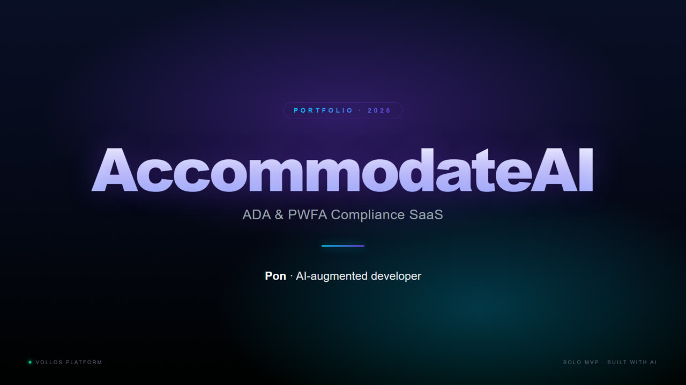
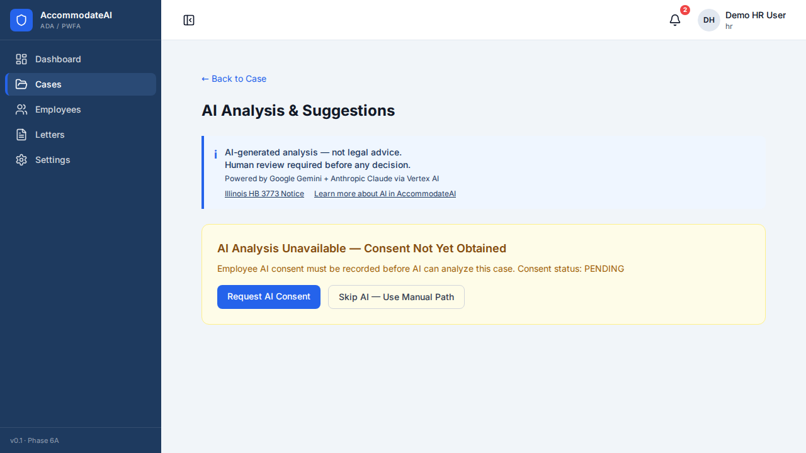
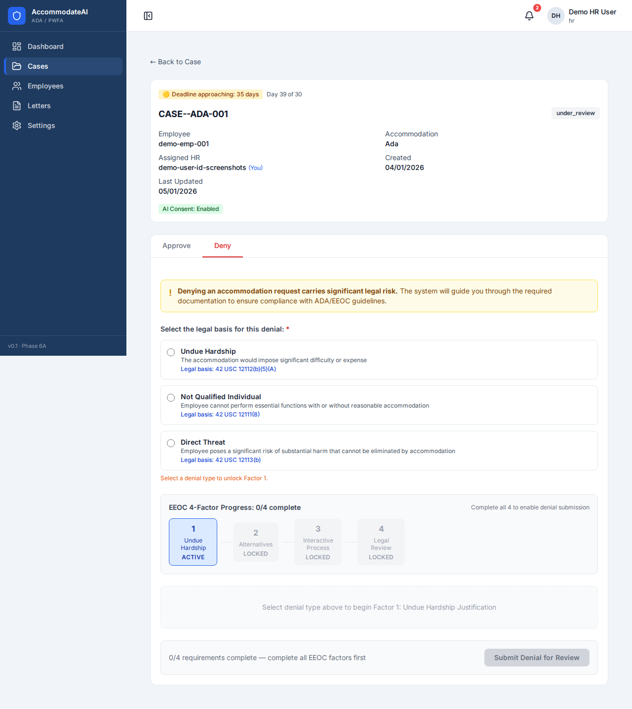
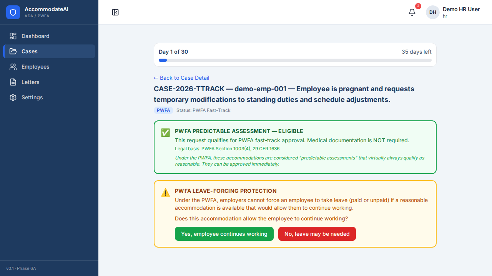
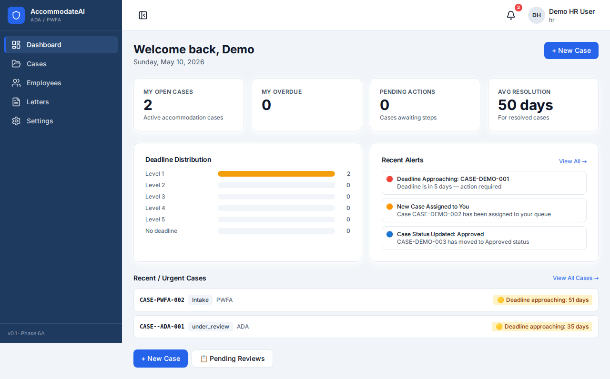
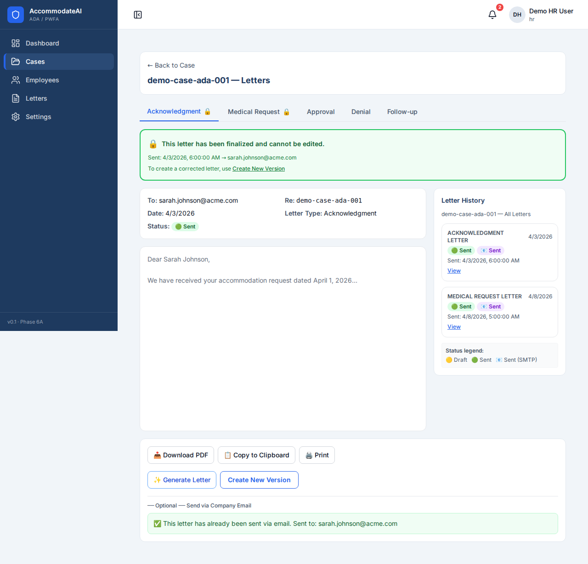

# AccommodateAI

ADA / PWFA HR Compliance SaaS — multi-tenant **Interactive Process** automation with AI-assisted case analysis, audit-ready timeline, and legally compliant letter generation.

> **The problem:** 43% of US HR teams still manage workplace accommodation requests via spreadsheets and email — leaving no audit trail. Average lawsuit settlement when the process fails: **$160K**.

> **What this builds:** intake → AI analysis → documentation → deadline tracking → letters (PDF + email + print) — all in one tenant-isolated workflow.

---

## 🎥 Walkthrough Video

[](https://github.com/tummada/AccommodateAI/raw/main/docs/accommodate-ai-walkthrough.mp4)

*Click the cover to open the 2:17 walkthrough — AI Interactive Process, EEOC 4-Factor denial flow, PWFA fast-track, and letter generation. Most browsers play inline; otherwise the MP4 (1.9 MB) downloads.*

---

## 📸 Screenshots

| AI Analysis & Suggestions (HERO) | EEOC 4-Factor Denial Progress |
|----------------------------------|-------------------------------|
|  |  |
| Vertex AI (Gemini) + Claude orchestration · Illinois HB 3773 disclosure · consent-gated AI | Step-by-step EEOC denial framework with legal warning UI |

| PWFA Predictable Assessment | Dashboard + KPIs |
|------------------------------|------------------|
|  |  |
| PWFA Section 1003(4) fast-track · leave-forcing protection | Case load, alerts, and deadline distribution at a glance |

| Letter Workflow |
|-----------------|
|  |
| PDF + email + print, with version-history sidebar |

---

## 🏗️ Architecture

Built on a shared multi-tenant core with a product-specific application layer.

```
vollos-platform/
├── vollos-core/          # Shared infrastructure
│   ├── apps/
│   │   ├── api/          # Core REST API
│   │   ├── auth-service/ # JWT authentication + Google One Tap
│   │   └── landing/      # Marketing landing page
│   └── packages/
│       ├── auth/         # Shared auth logic
│       ├── db/           # PostgreSQL + Drizzle ORM
│       └── crypto/       # Encryption utilities
│
└── acmd/                 # AccommodateAI product
    ├── apps/
    │   ├── api/          # Product API (Hono)
    │   ├── web/          # React dashboard
    │   └── landing/      # Product landing page
    └── packages/
        ├── db/           # Product DB schema
        └── ai/           # AI pipeline (Vertex + Claude)
```

---

## ⚙️ Tech Stack

| Layer | Technology |
|-------|-----------|
| Runtime | Node.js 22 + TypeScript |
| API Framework | Hono.js |
| Frontend | React 19 + Vite |
| Database | PostgreSQL 16 + Drizzle ORM |
| AI | Vertex AI (Gemini) + Anthropic Claude |
| PDF | PDFKit |
| Auth | JWT (RSA) + Google One Tap |
| Infrastructure | Docker Compose + Caddy (auto-HTTPS) |
| Monorepo | pnpm workspaces + Turborepo |
| CI/CD | GitLab CI |

---

## ✨ Key Features

- **Multi-tenant data isolation** — row-level isolation per HR tenant
- **AI Interactive Process** — Vertex AI (Gemini) + Claude orchestration for case analysis & suggestions
- **EEOC 4-Factor denial framework** — step-by-step legal compliance UI
- **PWFA Section 1003(4) fast-track** — predictable assessments + leave-forcing protection
- **Illinois HB 3773 disclosure** — consent-gated AI for IL employers
- **Letter workflow** — PDF generation, email delivery, version-history sidebar
- **Audit-ready timeline** — every case action timestamped + queryable
- **CCPA / GDPR compliant** — right-to-delete, IP / UA anonymization

---

## 🔒 Security

- Row-level data isolation per tenant
- RSA-signed JWT tokens with rotation support
- All secrets via environment variables (never hardcoded)
- Static analysis with Semgrep + Gitleaks + OWASP checks
- HTTPS enforced via Caddy with Cloudflare Origin certificates
- Rate limiting on all auth endpoints

---

## 🛠️ Local Development

```bash
# Install dependencies
pnpm install

# Start all services
docker compose up -d

# Run migrations
pnpm db:migrate

# Start dev server
pnpm dev
```

> Requires: Node.js 22+, pnpm, Docker

---

**Status:** Working build · Solo MVP · No paying customers yet
