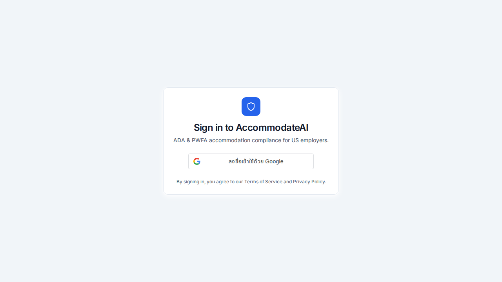
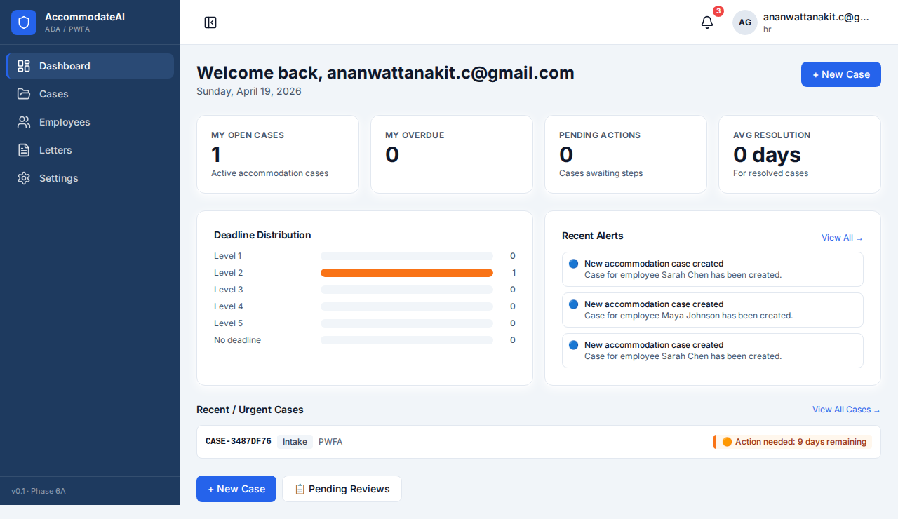

# VOLLOS Platform

Two AI SaaS products deployed to production — built solo using AI-assisted development with a shared multi-tenant core. Each product solves a real compliance problem in a specific industry.

> **Stack:** Node.js 22 · TypeScript · PostgreSQL · Docker · Caddy · GitLab CI/CD

## Products Built

### 🛡️ CustomsGuard AI
Thai customs clerks spend 3-5 hours per declaration manually looking up HS Codes. One wrong classification = $3,000+ penalty.

This product automates HS Code classification, duty calculation, and declaration form generation using AI — cutting prep time by ~70%.

### 🏢 AccommodateAI
43% of HR teams still manage workplace accommodation requests (ADA/PWFA) via spreadsheets and email — leaving no audit trail. Average lawsuit settlement when process fails: **$160K**.

This product automates the full Interactive Process — intake, documentation, deadline tracking, and legally compliant letter generation.

### Screenshots

| Login | Dashboard |
|-------|-----------|
|  |  |

---

## Architecture

```
vollos-platform/
├── vollos-core/          # Shared infrastructure
│   ├── apps/
│   │   ├── api/          # Core REST API
│   │   ├── auth-service/ # JWT authentication + Google One Tap
│   │   └── landing/      # Marketing landing page
│   └── packages/
│       ├── auth/         # Shared auth logic
│       ├── db/           # PostgreSQL + Drizzle ORM
│       └── crypto/       # Encryption utilities
│
└── acmd/                 # AccommodateAI product
    ├── apps/
    │   ├── api/          # Product API
    │   ├── web/          # React dashboard
    │   └── landing/      # Product landing page
    └── packages/
        ├── db/           # Product DB schema
        └── ai/           # AI pipeline
```

---

## Tech Stack

| Layer | Technology |
|-------|-----------|
| Runtime | Node.js 22 + TypeScript |
| API Framework | Hono.js |
| Frontend | React 19 + Vite |
| Database | PostgreSQL 16 + Drizzle ORM |
| Auth | JWT (RSA) + Google One Tap |
| Infrastructure | Docker Compose + Caddy (auto-HTTPS) |
| Monorepo | pnpm workspaces + Turborepo |
| CI/CD | GitLab CI → VPS auto-deploy |

---

## Key Features

- **Multi-tenant architecture** — strict data isolation between customers at the database level
- **Google One Tap** sign-in + manual email registration
- **Rate limiting** on all auth endpoints
- **CCPA/GDPR compliant** — right-to-delete, IP/UA anonymization
- **Production hardened** — Cloudflare + Caddy reverse proxy, fail2ban, UFW firewall
- **Monorepo** — shared packages across products, single CI/CD pipeline

---

## Security

- Row-level data isolation per tenant
- RSA-signed JWT tokens with rotation support
- All secrets via environment variables (never hardcoded)
- Security scanned with Semgrep + Gitleaks + OWASP checks
- HTTPS enforced via Caddy with Cloudflare Origin certificates

---

## Local Development

```bash
# Install dependencies
pnpm install

# Start all services
docker compose up -d

# Run migrations
pnpm db:migrate

# Start dev server
pnpm dev
```

> Requires: Node.js 22+, pnpm, Docker
